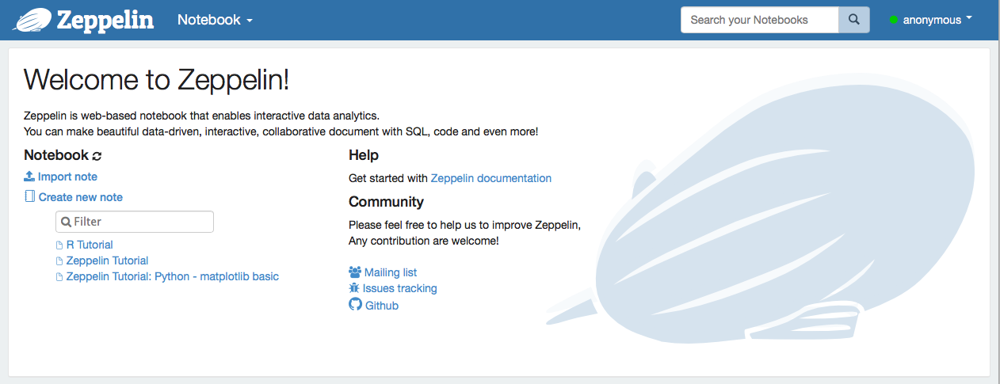
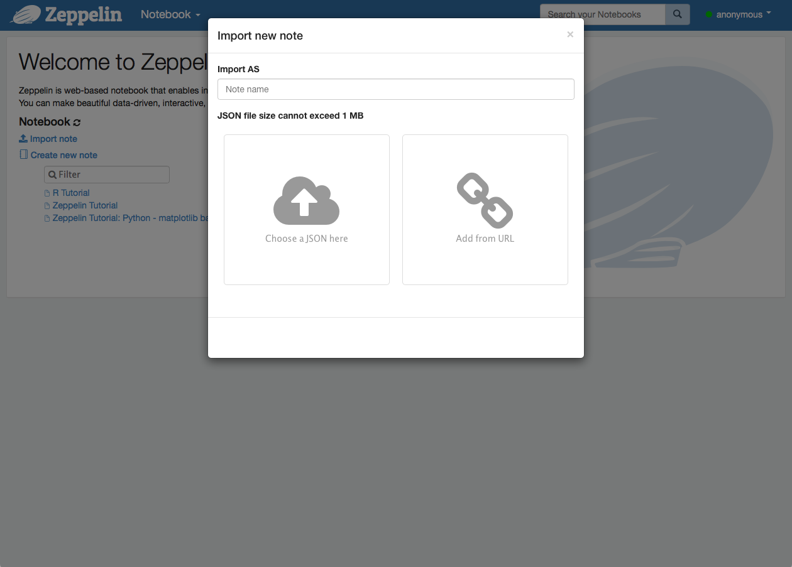
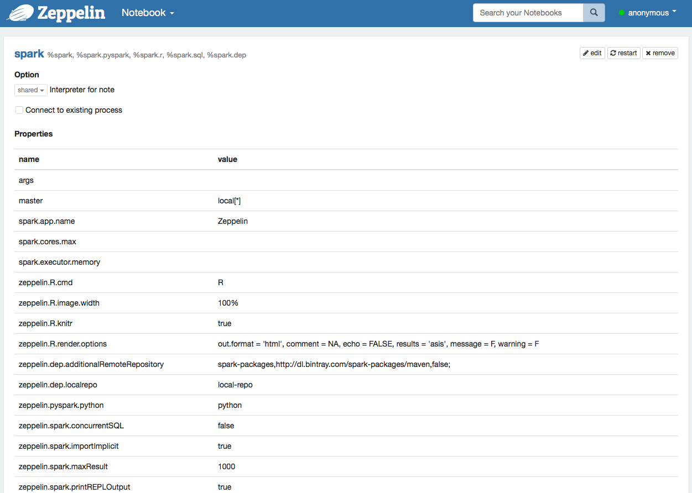

# tallerhadoopspark1
***

## Index:
1. [Preparing the environment](#preparing)
2. [Launching Hadoop HDFS](#HDFS)
3. [Running YARN Resource Manager.](#YARN)
4. [Launching Spark.](#SPARK)
  4.1. [Launch Spark in Local Mode.](#SPARKLOCAL)
  4.2. [Launch Spark in Standalone Cluster Mode.](#SPARKSTANDALONE)
  4.3. [Launch Spark Shell in YARN.](#SPARKYARN)
5. [Optional - Change the verbosity of Spark.](#VERBOSITY)
6. [Running Examples.](#EXAMPLES)
7. [Zeppelin Notebooks.](#ZEPPELIN)

---

### 1. Preparing the environment <a name="preparing"></a>
- Download the code from this repository:
```Bash
git clone https://github.com/KennethLobato/tallerhadoopspark1.git
```

- This Vagrantfile should create two machines, *ubuntu1* and *ubuntu2*. Edit the Vagrantfile to specify the amount of memory that you want in each VM.

- Launch vagrant. This step should create the machines, if you want to speed up the process you can download the following links and leave the *tar* or *tgz* in the same folder where you downloaded this repo, otherwise the provisioning process in the Vagrantfile will do it:
    * http://d3kbcqa49mib13.cloudfront.net/spark-1.6.2-bin-hadoop2.6.tgz
    * http://ftp.cixug.es/apache/hadoop/common/hadoop-2.7.3/hadoop-2.7.3.tar.gz
    * http://apache.rediris.es/zeppelin/zeppelin-0.6.2/zeppelin-0.6.2-bin-all.tgz

```Bash
vagrant up
```

Wait for vagrant to finish the setup of this small cluster, and connect to both machines "ubuntu1" and "ubuntu2" in two separate command shells:
```Bash
vagrant ssh ubuntu1
```
```Bash
vagrant ssh ubuntu2
```

Verify that the /etc/hosts has the following information (otherwise edit it with *vim* or *nano*):
```Bash
vagrant@ubuntu1:~$ cat /etc/hosts
127.0.0.1 localhost

10.0.0.10 ubuntu1.tallerhadoop1.org ubuntu1
10.0.0.11 ubuntu2.tallerhadoop1.org ubuntu2
```

### 2. Launching Hadoop HDFS. <a name="HDFS"></a>
Connect to the following machines with SSH to accept their fingerprint:
```Bash
vagrant@ubuntu1:~$ ssh ubuntu1
vagrant@ubuntu1:~$ ssh ubuntu2
vagrant@ubuntu1:~$ ssh localhost
vagrant@ubuntu1:~$ ssh 0.0.0.0
```

Ask to format the HDFS's NameNode:
```Bash
vagrant@ubuntu1:~$ hdfs namenode -format
```

Start the HDFS:
```Bash
vagrant@ubuntu1:~$ cd /usr/local/hadoop/
vagrant@ubuntu1:~$ ./sbin/start-dfs.sh
```
Verify that the namenode, datanode and snamenode are started properly:
```Bash
vagrant@ubuntu1:/usr/local/hadoop$ jps
4260 SecondaryNameNode
4039 DataNode
4376 Jps
3852 NameNode
```

```Bash
vagrant@ubuntu2:~$ jps
3625 Jps
3550 DataNode
```

Create the folders /user/vagrant in the HDFS:
```Bash
vagrant@ubuntu1:/usr/local/hadoop$ hdfs dfs -mkdir -p /user/vagrant/
vagrant@ubuntu1:/usr/local/hadoop$ hdfs dfs -ls /
Found 1 items
drwxr-xr-x   - vagrant supergroup          0 2016-10-12 17:02 /user
vagrant@ubuntu1:/usr/local/hadoop$ hdfs dfs -ls /user/
Found 1 items
drwxr-xr-x   - vagrant supergroup          0 2016-10-12 17:02 /user/vagrant
vagrant@ubuntu1:/usr/local/hadoop$ hdfs dfs -ls /user/vagrant/
```
Optionally, you can include the names of the machines in */etc/hosts* (Mac or Linux) or in *C:/Windows/System32/drivers/etc/hosts* (Windows):
```Bash
10.0.0.10 ubuntu1.tallerhadoop1.org ubuntu1
10.0.0.11 ubuntu2.tallerhadoop1.org ubuntu2
```
Verify that is properly running with a browser opening any of these links:
- http://ubuntu1:50070
- http://10.0.0.10:50070

### 3. Running YARN Resource Manager. <a name="YARN"></a>
Start YARN Resource Manager:
```Bash
vagrant@ubuntu1:/usr/local/hadoop$ ./sbin/start-yarn.sh
starting yarn daemons
starting resourcemanager, logging to /usr/local/hadoop-2.7.3/logs/yarn-vagrant-resourcemanager-ubuntu1.out
ubuntu2: starting nodemanager, logging to /usr/local/hadoop-2.7.3/logs/yarn-vagrant-nodemanager-ubuntu2.out
ubuntu1: starting nodemanager, logging to /usr/local/hadoop-2.7.3/logs/yarn-vagrant-nodemanager-ubuntu1.out
```
Verify that the following processes are running (ResourceManager and NodeManager):
```Bash
vagrant@ubuntu1:/usr/local/hadoop$ jps
4592 ResourceManager
4756 NodeManager
4260 SecondaryNameNode
4039 DataNode
5049 Jps
3852 NameNode
```
```Bash
vagrant@ubuntu2:~$ jps
3729 NodeManager
3833 Jps
3550 DataNode
```
Verify that is properly running with a browser opening any of these links:
- http://ubuntu1:8088
- http://10.0.0.10:8088

### 4. Launching Spark. <a name="SPARK"></a>


#### 4.1 Launch Spark Shell in Local Mode. <a name="SPARKLOCAL"></a>

To launch Spark in local mode you don't need the Standalone Cluster or YARN to be running. If you have assigned a small amount of RAM memory, this should be your choice. In any case, it's better to store the data in HDFS, which can be accessed with *hdfs://ubuntu1:9000/user/vagrant/fileOrFolderName*

```Bash
vagrant@ubuntu1:~$ cd /usr/local/spark/
vagrant@ubuntu1:/usr/local/spark$ ./bin/start-master.sh --master local[*]
(...)
Welcome to
      ____              __
     / __/__  ___ _____/ /__
    _\ \/ _ \/ _ `/ __/  '_/
   /___/ .__/\_,_/_/ /_/\_\   version 1.6.2
      /_/

Using Scala version 2.10.5 (Java HotSpot(TM) 64-Bit Server VM, Java 1.7.0_80)
(...)
scala> sc
res0: org.apache.spark.SparkContext = org.apache.spark.SparkContext@2b3a101e
```

#### 4.2 Launch Spark in Standalone Cluster Mode. <a name="SPARKSTANDALONE"></a>
Using the Standalone Cluster Mode you don't YARN to be running. To launch Spark Shell in Standalone cluster mode:
```Bash
vagrant@ubuntu1:~$ cd /usr/local/spark/
vagrant@ubuntu1:/usr/local/spark$ ./sbin/start-master.sh
vagrant@ubuntu1:/usr/local/spark$ ./sbin/start-slave.sh spark://ubuntu1:7077
```

```Bash
vagrant@ubuntu2:/usr/local/spark$ ./sbin/start-slave.sh spark://ubuntu1:7077
```

Make a test that spark is properly installed (this should launch the shell REPL):
```Bash
vagrant@ubuntu1:/usr/local/spark$ ./bin/spark-shell --master spark://ubuntu1:7077
(...)
scala> sc
res1: org.apache.spark.SparkContext = org.apache.spark.SparkContext@4045fd1f
```
Open in a browser any of the following addresses to check the Standalone Cluster:
- http://ubuntu1:8080
- http://10.0.0.10:8080

#### 4.3 Launch Spark Shell in YARN. <a name="SPARKYARN"></a>
To launch Spark Shell over YARN you don't need to run Spark Cluster Standalone. *Spark-Shell* command will review the YARN configuration by means of the exported environment var *HADOOP_CONF_DIR*, which is included in the */home/vagrant/.bashrc*. Execute the following commands:
```Bash
vagrant@ubuntu1:/usr/local/spark$ ./bin/spark-shell --master yarn-client
(...)
scala> sc
res1: org.apache.spark.SparkContext = org.apache.spark.SparkContext@4045fd1f
```

### 5 Optional - Change the verbosity of Spark. <a name="VERBOSITY"></a>
We can set up the level of verbosity with the following commands:

```Bash
vagrant@ubuntu1:/usr/local/spark$ mv conf/log4j.properties.template conf/log4j.properties
```

Editar el fichero y cambiar las líneas:
```Bash
log4j.rootCategory=INFO, console
```

Por:
```Bash
log4j.rootCategory=ERROR, console
```
### 6. Running Examples. <a name="EXAMPLES"></a>
Follow up the examples guide of Spark and take a look to the spark-submit command:
- http://spark.apache.org/docs/1.6.2/quick-start.html
- http://spark.apache.org/docs/latest/submitting-applications.html

Before you continue with the examples, you need to pay attention to the following notes:
- To install sbt:
```Bash
vagrant@ubuntu1:/usr/local/spark$ wget https://dl.bintray.com/sbt/debian/sbt-0.13.12.deb
vagrant@ubuntu1:/usr/local/spark$ sudo dpkg -i sbt-0.13.12.deb
vagrant@ubuntu1:/usr/local/spark$ sudo apt-get install scala
```
- In the SimpleApp example, no matter how you launch, change the filepath according to:
  * Local Mode: *hdfs://ubuntu1:9000/user/vagrant/README.md*
  * Standalone Cluster Mode: *hdfs://ubuntu1:9000/user/vagrant/README.md*
  * YARN Mode: */user/vagrant/README.md*

### 7. Zeppelin Notebooks. <a name="ZEPPELIN"></a>
If you are working with the Spark Standalone Cluster, Zeppelin and Spark Cluster UI will collision at the same port, to change default Zeppelin port to the following (otherwise you can continue):

- Edit file */usr/local/zeppelin/conf/zeppelin-site.xml.template* and change port 8080 to 9090:
```Bash
(...)
<property>
  <name>zeppelin.server.port</name>
  <value>8080</value>
  <description>Server port.</description>
</property>
(...)
```

- Move (rename) or copy the file:
```Bash
vagrant@ubuntu1:/usr/local/zeppelin$ cp conf/zeppelin-site.xml.template conf/zeppeling-site.xml
```
To run Zeppelin Notebook:
```Bash
vagrant@ubuntu1:/usr/local/zeppelin$ ./bin/zeppelin-daemon start
Zeppelin is running                                        [  OK  ]
vagrant@ubuntu1:/usr/local/zeppelin$ ./bin/zeppelin-daemon status
Zeppelin is running                                        [  OK  ]
```

Zeppelin will be ready at the following addresses:
- http://ubuntu1:8080 or http://ubuntu1:9090
- http://10.0.0.10:8080 or http://10.0.0.10:8080



Steps to import an existing Notebook:
- Click on **Import Note** in the main screen (you can always get to page click in the Zeppelin Logo, top left corner).



- Select JSON and select the file that you want to upload. There are two Notebooks included in this repo:
  + *Zeppelin - Spark - Scala - Introduction*. This Notebook has been created following Advanced Spark Analytics Book, within its introduction to Scala language.
  + *Zeppelin Intro Scala*. This Notebook has been extracted from Hortonworks Zeppelin Notebook, as an example of the features that can be provided with this environment.

Steps to change Spark launching mode depending on the configuration that you have selected:
- Click on **anonymous** and select ***Interpreter***.
- Type in the search textbox *spark* or scroll down until you arrive to the following screen:

- Click on *edit* and change **master** to your selection:
  + Local mode: local\[\*\] (Defaul)
  + Standalone mode: *spark://ubuntu1.tallerhadoop1.org:7077*
  + Yarn mode: *yarn-client*
- Save the changes (this will reload the interpreter)

If you need more information about Zeppelin Notebook, you can visit the following link: https://zeppelin.apache.org/docs/0.6.2/
